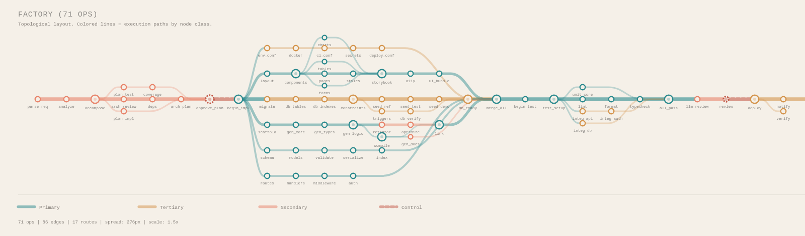
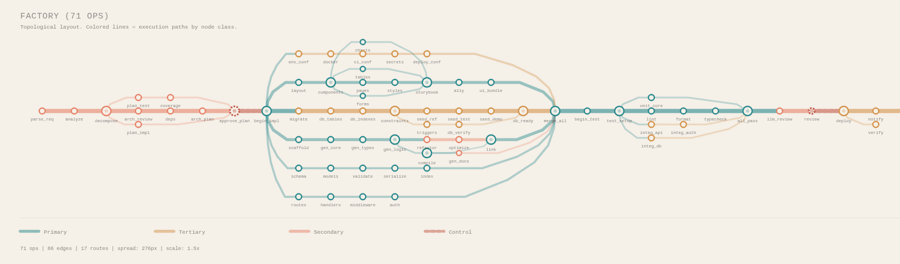
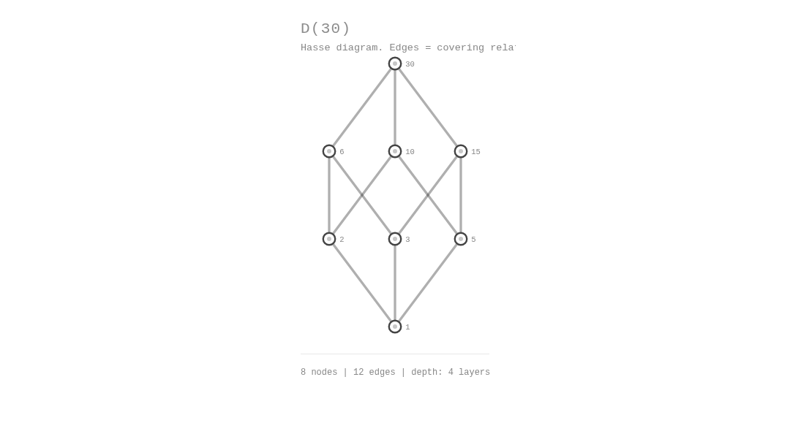
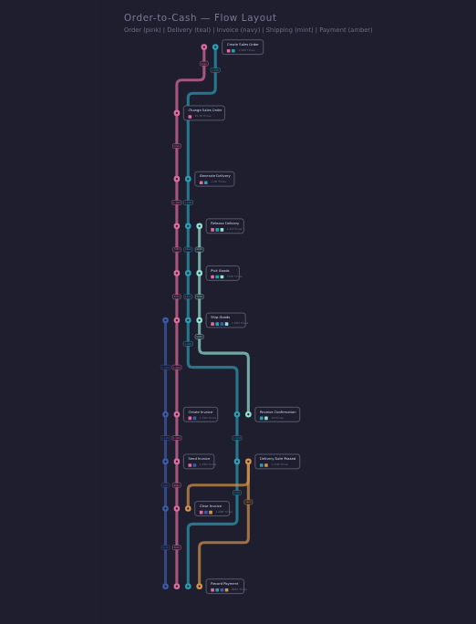
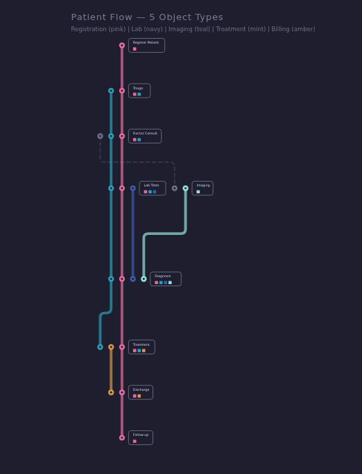
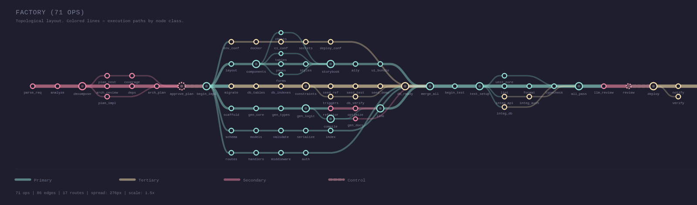
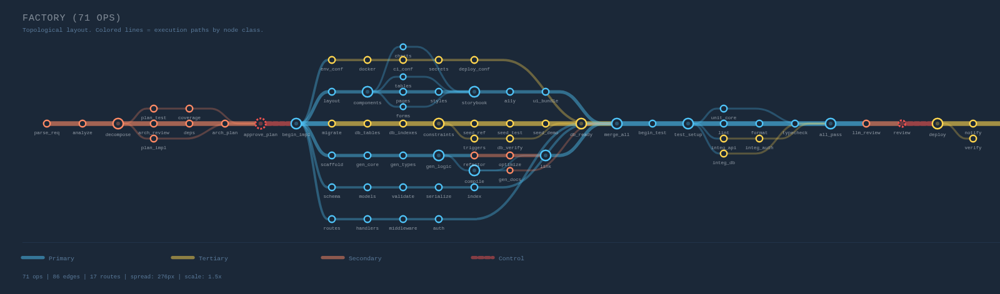
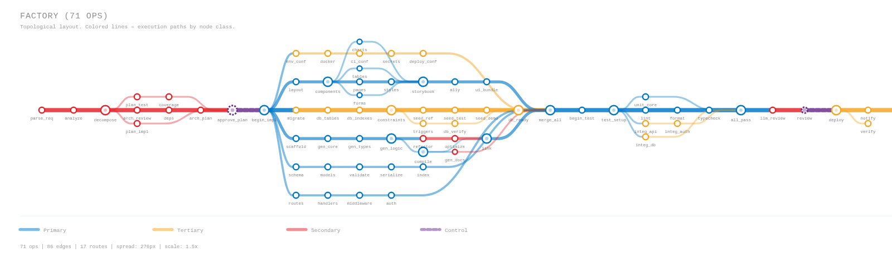
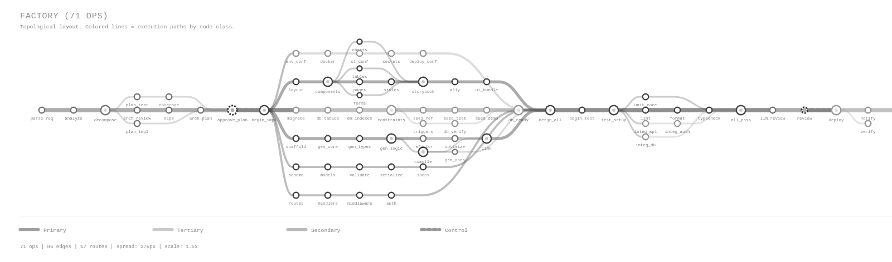
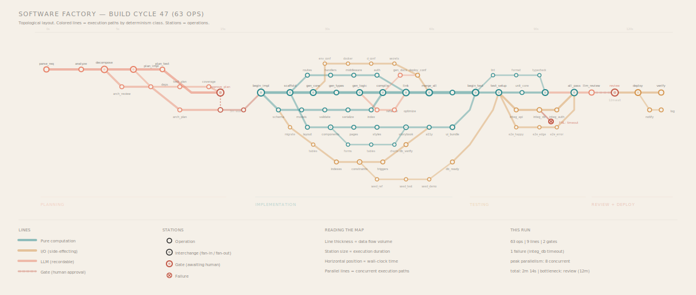

# dag-map

DAG visualization as metro maps. Three layout engines — **metro** (transit-map aesthetic), **Hasse** (lattice diagrams), and **flow** (process-mining with multi-class routes) — all rendered as SVG. No build step, no dependencies, raw ES modules.



## Demo

[**Metro map demo**](https://23min.github.io/DAG-map/demo/dag.html) — or open `demo/dag.html` directly in a browser. No server needed. Features:
- DAG selector (8 sample graphs of varying size and shape)
- Routing toggle (bezier / angular)
- Theme selector (6 built-in themes)
- Diagonal labels with angle slider
- Advanced section with layout parameter sliders
- Live code snippet showing current options, syntax-highlighted and copyable

[**Hasse diagram demo**](https://23min.github.io/DAG-map/demo/hasse.html) — or open `demo/hasse.html` directly. 13 example lattices and DAGs (Boolean lattice, divisibility, set inclusion, face lattice, and more), each with mathematical context. No server needed.

**Flow layout demo** — generate with `node demo/flow.mjs > demo/flow.html`. Process-mining style: multiple colored routes (object types) flow through shared activities, with obstacle-aware routing and adaptive spacing.

## Quick start

```javascript
import { dagMap } from 'dag-map';

const dag = {
  nodes: [
    { id: 'fetch', label: 'fetch', cls: 'side_effecting' },
    { id: 'parse', label: 'parse', cls: 'pure' },
    { id: 'analyze', label: 'analyze', cls: 'recordable' },
    { id: 'approve', label: 'approve', cls: 'gate' },
    { id: 'deploy', label: 'deploy', cls: 'side_effecting' },
  ],
  edges: [
    ['fetch', 'parse'], ['parse', 'analyze'],
    ['analyze', 'approve'], ['approve', 'deploy'],
  ],
};

const { layout, svg } = dagMap(dag);
document.getElementById('container').innerHTML = svg;
```

### Standalone bundle (no build step)

For environments without ES modules (LiveView, server-rendered HTML, prototypes), use the pre-built bundle:

```html
<script src="dag-map-bundle.js"></script>
<script>
  const layout = DagMap.layoutMetro(dag);
  const svg = DagMap.renderSVG(dag, layout, { cssVars: true });
  document.getElementById('container').innerHTML = svg;
</script>
```

Build it with `node build-bundle.mjs` (output: `dist/dag-map-bundle.js`). The `window.DagMap` object exposes:

| Function | Description |
|----------|-------------|
| `layoutMetro(dag, opts?)` | Metro layout engine |
| `layoutHasse(dag, opts?)` | Hasse diagram layout |
| `layoutFlow(dag, opts?)` | Process-mining flow layout |
| `renderSVG(dag, layout, opts?)` | SVG renderer |
| `resolveTheme(name)` | Resolve theme name to theme object |
| `THEMES` | All built-in theme objects |
| `dominantClass(dag)` | Most common node class in a DAG |
| `validateDag(nodes, edges)` | Non-throwing DAG validation |
| `swapPathXY(d)` | SVG path X↔Y coordinate swap |
| `colorScales` | Color scale functions for heatmap mode |
| `createStationRenderer(layout, routes)` | Flow layout station renderer |
| `createEdgeRenderer(layout, volumes?)` | Flow layout edge renderer |

## API

### `dagMap(dag, options?)` — convenience function

Runs layout + render in one call. Returns `{ layout, svg }`.

### `layoutMetro(dag, options?)` — layout engine

Computes node positions, route paths, and edge geometry. Returns a layout object.

```javascript
import { layoutMetro } from 'dag-map';

const layout = layoutMetro(dag, {
  routing: 'bezier',        // 'bezier' (default) | 'angular'
  direction: 'ltr',         // 'ltr' (default) | 'ttb' (top-to-bottom)
  theme: 'cream',           // theme name or custom theme object
  scale: 1.5,               // global size multiplier (default: 1.5)
  layerSpacing: 38,         // px between topological layers (before scale)
  mainSpacing: 34,          // px between depth-1 branch lanes (before scale)
  subSpacing: 16,           // px between sub-branch lanes (before scale)
  progressivePower: 2.2,    // angular routing: curve aggressiveness (1.0–3.5)
  maxLanes: null,           // cap on lane count (null = unlimited)
});
```

### `renderSVG(dag, layout, options?)` — SVG renderer

Renders a layout into an SVG string.

```javascript
import { renderSVG } from 'dag-map';

const svg = renderSVG(dag, layout, {
  title: 'MY PIPELINE',     // title text at top of SVG
  subtitle: 'Custom sub',   // subtitle text (default: auto-generated)
  diagonalLabels: false,     // tube-map style angled station labels
  labelAngle: 45,            // angle in degrees (0–90) when diagonalLabels is true
  showLegend: true,          // show legend at bottom
  cssVars: false,            // use CSS var() references instead of inline colors
  legendLabels: {            // custom legend text per class
    pure: 'Compute',
    recordable: 'AI/ML',
    side_effecting: 'I/O',
    gate: 'Approval',
  },
  // Font size multipliers (before scale):
  titleSize: 10,             // title font size (default: 10)
  subtitleSize: 6.5,         // subtitle font size (default: 6.5)
  labelSize: 5,              // node label font size (default: 5)
  legendSize: 6.5,           // legend + stats font size (default: 6.5)
});
```

## Node dimming

Set `dim: true` on any node to render it at reduced opacity. Dimmed nodes, their labels, and any edges touching them fade out — useful for showing pending/inactive nodes in execution visualizations or heatmap overlays.

```javascript
const dag = {
  nodes: [
    { id: 'a', label: 'completed', cls: 'pure' },
    { id: 'b', label: 'running', cls: 'recordable' },
    { id: 'c', label: 'pending', cls: 'pending', dim: true },
    { id: 'd', label: 'pending', cls: 'pending', dim: true },
  ],
  edges: [['a', 'b'], ['b', 'c'], ['c', 'd']],
};
```

Control the dim intensity with `dimOpacity` (0–1, default 0.25) in both `layoutMetro` and `renderSVG` options. All 6 built-in themes include a `pending` class color.

## DOM attributes

Each node produces SVG elements with data attributes for scripting:

- `<g data-node-id="nodeId" data-node-cls="pure">` — group wrapper
- `<circle data-id="nodeId" ...>` — the station circle

```javascript
svg.querySelectorAll('circle[data-id]').forEach(circle => {
  circle.addEventListener('click', () => console.log('Clicked:', circle.dataset.id));
});
```

## CSS classes

All text elements in the SVG carry semantic CSS classes for external styling:

| Class | Element |
|-------|---------|
| `dm-title` | Title text |
| `dm-subtitle` | Subtitle text |
| `dm-label` | Node (station) labels |
| `dm-metric-label` | Metric value labels above nodes (heatmap mode) |
| `dm-legend-text` | Legend entry labels |
| `dm-stats` | Stats line at bottom (node/edge/route counts) |

These classes are always present regardless of `cssVars` mode. Use them for font-size overrides, animations, or hiding elements:

```css
.dm-title { font-size: 18px !important; }
.dm-label { opacity: 0.8; }
.dm-stats { display: none; }  /* hide the stats line */
```

## Color modes

### Inline colors (default)

SVGs contain hardcoded hex colors. Portable — works in ``, email, Figma, PDF export, server-side rendering.

```javascript
renderSVG(dag, layout); // colors baked into the SVG
```

### CSS variables (opt-in)

SVGs reference CSS custom properties. Themeable from CSS — responds to `prefers-color-scheme`, hover effects, and runtime changes without re-rendering. Requires the SVG to be inline in the DOM (not ``).

```javascript
renderSVG(dag, layout, { cssVars: true });
```

The SVG output uses `var(--dm-paper)`, `var(--dm-cls-pure)`, etc. Override them in your stylesheet:

```css
/* Dark mode via CSS only — no JS re-render needed */
@media (prefers-color-scheme: dark) {
  :root {
    --dm-paper: #1E1E2E;
    --dm-ink: #CDD6F4;
    --dm-cls-pure: #94E2D5;
    --dm-cls-recordable: #F38BA8;
    --dm-cls-side-effecting: #F9E2AF;
    --dm-cls-gate: #EBA0AC;
  }
}
```

In `cssVars` mode, font sizes are also exposed as CSS custom properties with computed defaults:

| Variable | Default | Controls |
|----------|---------|----------|
| `--dm-title-size` | `titleSize * scale` | Title text |
| `--dm-subtitle-size` | `subtitleSize * scale` | Subtitle text |
| `--dm-label-size` | `labelSize * scale` | Node labels |
| `--dm-legend-size` | `legendSize * scale` | Legend text |
| `--dm-stats-size` | `(legendSize - 0.5) * scale` | Stats line |

Text elements use `style="font-size: var(--dm-title-size, <default>)"` so you can override sizes from CSS without re-rendering:

```css
svg { --dm-title-size: 20px; --dm-label-size: 8px; }
```

Default values for all CSS variables are provided in `src/dag-map.css` (metro layouts) and `src/hasse.css` (Hasse diagrams). Include the appropriate file for your use case — or both if using both layout engines.

## Routing styles

### Bezier (default)

Cubic bezier S-curves. Smooth, organic feel with adaptive control point spacing.

```javascript
layoutMetro(dag, { routing: 'bezier' });
```

### Angular (progressive)

Piecewise-linear curves with progressive steepening. Convergence edges (returning to trunk) start nearly flat and get steeper — like a ball rolling up a ramp. Divergence edges (departing from trunk) start steep and flatten out. Uses interchange-aware direction detection.



```javascript
layoutMetro(dag, { routing: 'angular', progressivePower: 2.2 });
```

The `progressivePower` parameter controls how aggressive the angle progression is:
- `1.0` — uniform angle (no progression, straight diagonal)
- `2.2` — default, natural-looking curve
- `3.5` — dramatic, very flat start then steep finish

## Hasse diagrams

`layoutHasse` renders lattices and partial orders using a Sugiyama-style layered layout. Where `layoutMetro` decomposes a DAG into routes (execution paths), `layoutHasse` treats every node as a point in a partial order — suitable for divisibility lattices, set inclusion, face lattices, concept lattices, and similar structures.

```javascript
import { layoutHasse, renderSVG } from 'dag-map';

const divisibility = {
  nodes: [
    { id: '1',  label: '1'  },
    { id: '2',  label: '2'  },
    { id: '3',  label: '3'  },
    { id: '6',  label: '6'  },
    { id: '12', label: '12' },
  ],
  // covering relations: [lesser, greater]
  edges: [['1','2'], ['1','3'], ['2','6'], ['3','6'], ['6','12']],
};

const layout = layoutHasse(divisibility, { theme: 'mono' });
const svg = renderSVG(divisibility, layout);
document.getElementById('container').innerHTML = svg;
```

Options:

| Parameter | Default | Description |
|-----------|---------|-------------|
| `theme` | `'mono'` | Theme name or custom theme object. Defaults to mono (clean for academic use). |
| `scale` | `1.5` | Global size multiplier. |
| `rankSpacing` | `80` | Vertical distance between layers (before scale). |
| `nodeSpacing` | `60` | Horizontal distance between nodes (before scale). |
| `edgeStyle` | `'bezier'` | `'bezier'` or `'straight'`. |
| `crossingPasses` | `24` | Barycenter sweep iterations for crossing reduction. |

Edges represent covering relations. By convention `[a, b]` means a is covered by b (a ≤ b, a lower in the diagram). See the [Hasse demo](https://23min.github.io/DAG-map/demo/hasse.html) for 13 worked examples.

| | |
|---|---|
|  |  |
| D(30) mono | D(30) cream |
|  |  |
| Π(4) blueprint | Π(4) dark |

## Flow layout

`layoutFlow` renders process-mining diagrams where multiple **object types** (routes) flow through shared **activities** (nodes). Inspired by tools like Celonis Process Explorer. The key concepts:

- **Routes** are colored lines representing entity types (orders, invoices, shipments, etc.) that flow through a process
- **Activities** are shared stations where routes converge — shown as punched-out dots on the lines, with info cards alongside
- **The trunk** (longest route) is laid first as a straight vertical spine; other routes branch off to the sides
- **Obstacle-aware routing** ensures lines bend around cards and other routes using V-H-V (vertical-horizontal-vertical) paths
- **Adaptive spacing** gives congested merge/fork zones more room while keeping simple stretches compact

| | |
|---|---|
|  |  |
| Order-to-Cash (5 object types, 12 activities) | Patient Flow (5 object types, 8 activities) |

### Input format

The DAG describes activities and their dependencies. Routes describe which object types pass through which activities:

```javascript
import { layoutFlow, renderSVG } from 'dag-map';

const dag = {
  nodes: [
    { id: 'register',  label: 'Register Patient' },
    { id: 'triage',    label: 'Triage' },
    { id: 'lab',       label: 'Lab Tests' },
    { id: 'imaging',   label: 'Imaging' },
    { id: 'diagnosis', label: 'Diagnosis' },
    { id: 'treat',     label: 'Treatment' },
  ],
  edges: [
    ['register', 'triage'], ['triage', 'lab'], ['triage', 'imaging'],
    ['lab', 'diagnosis'], ['imaging', 'diagnosis'], ['diagnosis', 'treat'],
  ],
};

// Each route is an object type flowing through a subset of activities.
// The cls key maps to a color in the theme.
const routes = [
  { id: 'clinical',   cls: 'clinical',   nodes: ['register', 'triage', 'lab', 'diagnosis', 'treat'] },
  { id: 'imaging',    cls: 'imaging',    nodes: ['triage', 'imaging', 'diagnosis'] },
  { id: 'admin',      cls: 'admin',      nodes: ['register', 'triage', 'treat'] },
];

const layout = layoutFlow(dag, {
  routes,
  theme: {
    paper: '#1E1E2E', ink: '#CDD6F4', muted: '#6C7086', border: '#313244',
    classes: { clinical: '#E06C9F', imaging: '#2B9DB5', admin: '#94E2D5' },
  },
});
const svg = renderSVG(dag, layout);
```

### Rendering

`layoutFlow` computes positions and paths. The default `renderSVG` renderer draws simple circles and labels. For richer visuals (punched-out dots, info cards, edge volume badges), use the station and edge renderers from `render-flow-station.js`:

```javascript
import { createStationRenderer, createEdgeRenderer } from 'dag-map/src/render-flow-station.js';

const renderNode = createStationRenderer(layout, routes);
const renderEdge = createEdgeRenderer(layout);

const svg = renderSVG(dag, layout, {
  renderNode,
  renderEdge,
  showLegend: false,
});
```

### Options

| Parameter | Default | Description |
|-----------|---------|-------------|
| `routes` | `[]` | Required. Array of `{id, cls, nodes: [nodeId...]}` defining object types. |
| `direction` | `'ttb'` | Layout direction. `'ttb'` = top-to-bottom, `'ltr'` = left-to-right. |
| `theme` | `'dark'` | Theme name or custom theme object. Route colors come from `theme.classes`. |
| `scale` | `1.5` | Global size multiplier. |
| `layerSpacing` | `55` | Base distance between layers along the flow axis (before scale). Congested layers get up to 2x automatically. |
| `columnSpacing` | `90` | Distance between node columns on the spread axis (before scale). |
| `dotSpacing` | `12` | Gap between parallel route dots at shared stations (before scale). |
| `cornerRadius` | `5` | Radius for elbow bends (before scale). |
| `lineThickness` | `3` | Route line width (before scale). |
| `labelSize` | `3.6` | Station card label font size (before scale). |

### How it works

1. **Topological sort + layer assignment** — activities are assigned to layers based on their longest path from sources
2. **Column assignment** — activities are grouped into columns by their primary route membership
3. **Adaptive layer spacing** — each layer gap is scored for congestion (bending routes, merge/fork points) and given 1x-2x the base spacing
4. **Trunk propagation** — the longest route's X position is fixed and propagated through all its nodes, forming a straight vertical spine
5. **Obstacle-aware routing** — dots and cards are placed into an occupancy grid; subsequent routes bend around existing obstacles using V-H-V paths with rounded elbows
6. **Extra edges** — DAG edges not covered by any route are drawn as dashed gray lines with their own endpoint dots

## Theming

### Built-in themes

| Theme | Description |
|-------|-------------|
| `cream` | Warm cream paper, muted ink. Default. |
| `light` | Clean white, slightly bolder colors. |
| `dark` | Dark background, pastel routes (Catppuccin-inspired). |
| `blueprint` | Dark navy, bright engineering-drawing colors. |
| `mono` | Pure grayscale. For print and academic papers. |
| `metro` | Classic transit-map colors (bold red/blue/orange/purple on white). |

```javascript
layoutMetro(dag, { theme: 'dark' });
```

| | |
|---|---|
|  |  |
| dark | blueprint |
|  |  |
| metro | mono |

### Custom themes

Pass a theme object instead of a name. Any missing properties fall back to the `cream` defaults.

```javascript
const myTheme = {
  paper: '#1a1a2e',           // background color
  ink: '#e0e0e0',             // primary text color
  muted: '#888888',           // secondary text, legend
  border: '#333333',          // separator lines
  classes: {                  // one color per node class
    pure: '#00b4d8',
    recordable: '#ff6b6b',
    side_effecting: '#ffd93d',
    gate: '#6bcb77',
  },
  lineOpacity: 1.0,           // multiplier for route line opacity (default: 1.0)
};

layoutMetro(dag, { theme: myTheme });
```

### Theme properties

| Property | Type | Default | Description |
|----------|------|---------|-------------|
| `paper` | string | `'#F5F0E8'` | Background color |
| `ink` | string | `'#2C2C2C'` | Primary text and station stroke color |
| `muted` | string | `'#8C8680'` | Secondary text, legend labels |
| `border` | string | `'#D4CFC7'` | Separator lines, borders |
| `classes` | object | `{pure, recordable, side_effecting, gate}` | Color per node class (keyed by `cls` value) |
| `lineOpacity` | number | `1.0` | Multiplier for route line opacity. Values >1 make lines bolder (e.g. `1.4` for the metro theme). Clamped to max 1.0 per line. |

### Custom node classes

The default class names (`pure`, `recordable`, `side_effecting`, `gate`) are just string identifiers. You can use any names — just match them between your node `cls` values, your theme's `classes` keys, and your `legendLabels`:

```javascript
const dag = {
  nodes: [
    { id: 'a', label: 'ingest', cls: 'io' },
    { id: 'b', label: 'transform', cls: 'compute' },
    { id: 'c', label: 'review', cls: 'human' },
  ],
  edges: [['a', 'b'], ['b', 'c']],
};

layoutMetro(dag, {
  theme: {
    classes: { io: '#F5A623', compute: '#0078C8', human: '#6A2D8E' },
  },
});

renderSVG(dag, layout, {
  legendLabels: { io: 'I/O', compute: 'Compute', human: 'Human gate' },
});
```

## Layout parameters

These control the spatial structure of the graph. All spacing values are in px **before** the `scale` multiplier is applied.

| Parameter | Default | Effect |
|-----------|---------|--------|
| `scale` | `1.5` | Global size multiplier. Affects all spatial values and rendering sizes. |
| `direction` | `'ltr'` | Layout direction. `'ltr'` = left-to-right (default). `'ttb'` = top-to-bottom. |
| `layerSpacing` | `38` | Distance between topological layers (horizontal in LTR, vertical in TTB). |
| `mainSpacing` | `34` | Vertical distance between depth-1 branch lanes. Higher = routes fan further from trunk. |
| `subSpacing` | `16` | Vertical distance between sub-branch lanes. Higher = sub-branches spread more. |
| `maxLanes` | `null` | Maximum lane count. `null` = unlimited. Lower values force a more compact layout. |

## Docs

- [DAG Visualization Landscape](docs/research/dag-visualization-landscape.md) — research on layout approaches, scale considerations, dynamic DAGs, and domain precedents

### Reference design

The reference that defined the visual language — interchange stations, route coloring, and progressive angular curves:



## Contributing

Contributions welcome — bug fixes, layout improvements, new themes, demo examples, and docs. Scope is DAG visualization: metro maps, Hasse diagrams, and process flow layouts. See [CONTRIBUTING.md](CONTRIBUTING.md) for details.

## License

Apache-2.0. See [`LICENSE`](LICENSE) for full text and [`NOTICE`](NOTICE)
for attribution notices. Relicensed from MIT on 2026-04-19 to align with
the broader product stack (FlowTime, Liminara) and gain explicit patent
grants.
